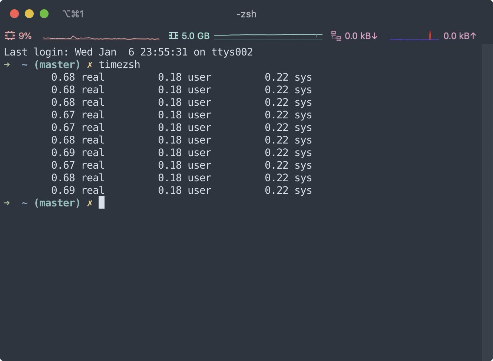

## MAC 備份
紀錄一下電腦需要裝的各種軟體的設定＋備份，免得哪天電腦壞了直接哭爆

>之後可以研究一下 `dotfile` 怎樣自動安裝好需要的程式與設定

### Homebrew
```bash
# Install homebrew
/bin/bash -c "$(curl -fsSL https://raw.githubusercontent.com/Homebrew/install/HEAD/install.sh)"

# check homebrew up to date
brew doctor
brew update
```

### ZSH
安裝完下面的shell以及管理套件後，將備份的 `zshrc_backup` 載下來到家目錄並改成 `.zshrc`，最後 `source ~/.zshrc`。

```bash
brew install zsh
brew install zplug
```
#### 加快terminal啟動速度
透過 `for i in $(seq 1 10); do /usr/bin/time zsh -i -c exit; done` 指令，查出來拖垮我啟動速度的元兇是 `nvm` 足足耗時要 2.8 sec 才能開始打字！
使用 `lazy-loading` 讓 `nvm` 不要在一啟動terminal就loading，設定如 `zshrc_backup` 所示。
但延遲了之後發現還是要 1.08 sec ，再透過指令去查詢發現問題出在 `__zplug::log::write::info` 佔了 58% 的啟動時間，下了 `touch $ZPLUG_LOADFILE` 之後[(ref)](https://github.com/zplug/zplug/issues/368#issuecomment-282566102)，啟動速度終於正常了。


### Git
安裝好git後，把備份的 `gitconfig_backup` 載下來到家目錄並改檔名為 `.gitconfig`。
```bash
# 確認好homebrew為最新版後安裝git
brew install git
```


### NVM
先用 `Homebrew` 裝 `nvm`，再用 `nvm` 做版本控制。
```bash
brew install nvm
# 安裝最新版
nvm install node
# 列出已安裝版本
nvm ls
# 列出可安裝版本
nvm ls-remote
# 安裝指定版本
nvm install vX.X.X
# 使用已安裝的版本
nvm use vX.X.X
```

